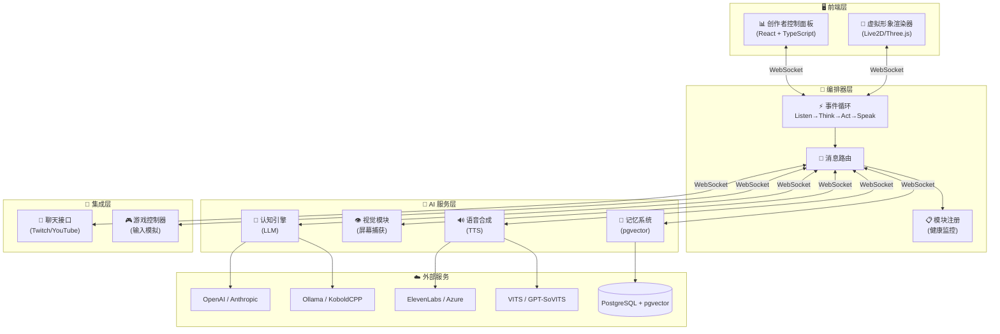
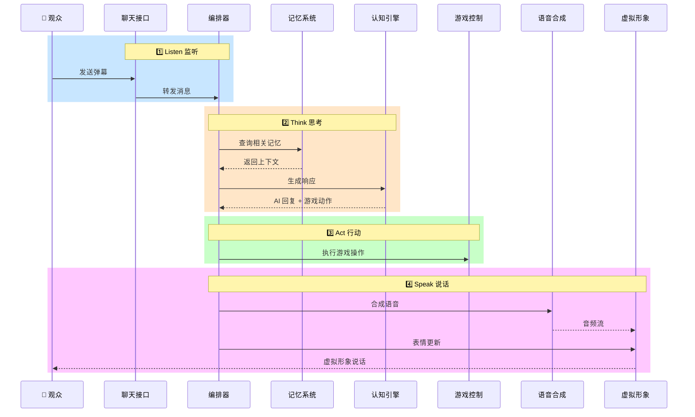

# AI VTuber Digital Human System

<p align="center">
  <strong>自主 AI VTuber "数字人"系统</strong><br/>
  一个能够自主玩游戏、与观众实时聊天、与创作者协作的 AI 驱动虚拟主播平台
</p>

<p align="center">
  <a href="#-快速开始">快速开始</a> •
  <a href="#-特性">特性</a> •
  <a href="#-系统架构">架构</a> •
  <a href="#-开发指南">开发</a> •
  <a href="#-许可证">许可证</a>
</p>

## ✨ 特性

| 功能 | 描述 |
|------|------|
| 🤖 **智能对话** | 基于 LLM 的认知引擎，支持云端 (OpenAI/Anthropic) 和本地模型 (Ollama/KoboldCPP) |
| 🎮 **自主游戏** | 视觉感知 + 游戏控制，支持自主、半自主、手动三种模式 |
| 💬 **直播互动** | 集成 Twitch IRC、YouTube Live Chat 和 Bilibili 弹幕，实时与观众互动 |
| 🗣️ **语音合成** | 支持 ElevenLabs、Azure TTS 及本地 VITS/GPT-SoVITS |
| 🧠 **长期记忆** | 基于向量数据库的语义记忆系统 |
| 👤 **虚拟形象** | Live2D/3D 角色渲染，支持表情和口型同步 |
| 🎛️ **控制面板** | Web 端创作者控制台，实时监控和覆盖 AI 决策 |
| 📦 **一键安装** | Windows 安装包，无需技术背景即可部署 |

## 🚀 快速开始

### 方式一：Windows 一键安装（推荐）

适合不熟悉技术的用户，安装程序会自动配置所有依赖。

1. 从 [Releases](https://github.com/your-username/ai-vtuber-digital-human/releases) 下载最新的 `AI-VTuber-Setup-x.x.x.exe`
2. 双击运行安装程序
3. 按照安装向导完成配置：
   - 选择安装路径
   - 配置 LLM 提供者（本地 Ollama/KoboldCPP 或云端 OpenAI/Anthropic）
   - 配置 TTS 提供者
   - 配置直播平台（Twitch/YouTube/Bilibili）
4. 安装完成后，从桌面快捷方式启动应用
5. 应用会在系统托盘运行，右键托盘图标可打开控制面板

> 💡 **提示**：首次安装本地 LLM 时，需要下载模型文件（约 4-8GB），请确保网络畅通。

### 方式二：手动安装（开发者）

#### 前置要求

- Node.js >= 18.0.0
- PostgreSQL 15+ (带 pgvector 扩展) 或 SQLite
- (可选) Ollama - 本地 LLM
- (可选) KoboldCPP - 本地 LLM (支持 GGUF 模型)
- (可选) VITS/GPT-SoVITS - 本地 TTS

#### 安装步骤

```bash
# 克隆仓库
git clone https://github.com/your-username/ai-vtuber-digital-human.git
cd ai-vtuber-digital-human

# 安装依赖
npm install

# 复制环境变量配置
cp .env.example .env
# 编辑 .env 填写实际配置

# 构建所有包
npm run build
```

#### 数据库设置

```sql
-- 创建数据库
CREATE DATABASE digital_human;

-- 连接到数据库后启用 pgvector 扩展
CREATE EXTENSION IF NOT EXISTS vector;
```

#### 运行

```bash
# 启动服务端 (Orchestrator + 所有模块)
npm run start:server

# 启动控制面板 (开发模式)
npm run start:dashboard
```

服务端默认运行在 `ws://localhost:3001`，控制面板运行在 `http://localhost:5173`。

## 🏗️ 系统架构



### 核心事件循环



## 📁 项目结构

```
ai-vtuber-digital-human/
├── packages/
│   ├── shared/              # 共享类型定义和消息序列化
│   ├── server/              # 服务端模块
│   │   ├── orchestrator/    # 编排器 (WebSocket, 消息路由, 事件循环)
│   │   ├── cognition/       # 认知引擎 (LLM 集成, 人格配置)
│   │   ├── memory/          # 记忆系统 (向量存储, 语义检索)
│   │   ├── vision/          # 视觉模块 (屏幕捕获, 游戏状态分析)
│   │   ├── tts/             # 语音合成 (多提供者支持)
│   │   ├── chat/            # 聊天接口 (Twitch/YouTube)
│   │   └── game-controller/ # 游戏控制器 (输入模拟)
│   └── client/              # 客户端模块
│       ├── dashboard/       # 创作者控制面板 (React)
│       └── avatar/          # 虚拟形象渲染器 (Live2D/Three.js)
├── installer/               # Windows 安装包构建
│   ├── electron/            # Electron 主进程代码
│   ├── wizard/              # 安装向导 UI
│   ├── assets/              # 图标资源
│   ├── build/               # NSIS 构建脚本
│   └── scripts/             # 构建脚本
├── .env.example             # 环境变量示例
└── package.json             # 根 package.json (workspaces)
```

## 🛠️ 技术栈

| 类别 | 技术 |
|------|------|
| 语言 | TypeScript |
| 前端 | React 18 + Vite + Live2D/Three.js |
| 后端 | Node.js + Socket.IO |
| 数据库 | PostgreSQL + pgvector / SQLite |
| 桌面应用 | Electron + electron-builder |
| 测试 | Jest + fast-check (属性测试) |
| 本地 AI | Ollama, KoboldCPP, VITS/GPT-SoVITS |

## ⚙️ 环境变量配置

复制 `.env.example` 为 `.env` 并配置：

<details>
<summary>点击展开完整配置说明</summary>

### 核心配置

| 变量 | 说明 | 默认值 |
|------|------|--------|
| `ORCHESTRATOR_PORT` | WebSocket 服务端口 | `3001` |
| `CORS_ENABLED` | 是否启用 CORS | `true` |

### 数据库配置

| 变量 | 说明 | 默认值 |
|------|------|--------|
| `POSTGRES_HOST` | PostgreSQL 主机 | `localhost` |
| `POSTGRES_PORT` | PostgreSQL 端口 | `5432` |
| `POSTGRES_DB` | 数据库名 | `digital_human` |
| `POSTGRES_USER` | 数据库用户 | `postgres` |
| `POSTGRES_PASSWORD` | 数据库密码 | - |

### LLM 配置

| 变量 | 说明 |
|------|------|
| `OPENAI_API_KEY` | OpenAI API 密钥 |
| `ANTHROPIC_API_KEY` | Anthropic API 密钥 |
| `OLLAMA_ENDPOINT` | Ollama 端点 (默认 `http://localhost:11434`) |
| `OLLAMA_MODEL` | Ollama 模型名 (默认 `llama3.2`) |

### TTS 配置

| 变量 | 说明 |
|------|------|
| `ELEVENLABS_API_KEY` | ElevenLabs API 密钥 |
| `AZURE_TTS_API_KEY` | Azure TTS API 密钥 |
| `VITS_ENDPOINT` | 本地 VITS 端点 |
| `GPT_SOVITS_ENDPOINT` | 本地 GPT-SoVITS 端点 |

### 聊天平台配置

| 变量 | 说明 |
|------|------|
| `TWITCH_USERNAME` | Twitch 机器人用户名 |
| `TWITCH_OAUTH_TOKEN` | Twitch OAuth Token |
| `TWITCH_CHANNEL` | Twitch 频道名 |
| `YOUTUBE_API_KEY` | YouTube API 密钥 |

</details>

## 📜 可用脚本

```bash
# 开发
npm run build              # 构建所有包
npm run start:server       # 启动服务端
npm run start:dashboard    # 启动控制面板
npm test                   # 运行测试
npm run lint               # 代码检查
npm run format             # 格式化代码

# Windows 安装包构建
cd installer
npm run build:installer    # 构建完整安装包 (生成 .exe)
npm run generate:icons     # 生成占位图标
```

## 🧪 测试

```bash
npm test                   # 运行所有测试
npm run test:watch         # 监听模式
```

项目包含 20+ 个属性测试，覆盖消息序列化、记忆系统、游戏控制、模块通信等核心功能。

## 📦 构建 Windows 安装包

如果你想自己构建安装包：

```bash
cd installer
npm install
npm run generate:icons     # 生成占位图标（或替换为自定义图标）
npm run build:installer    # 构建安装包
```

构建完成后，安装包位于 `installer/dist/` 目录，同时会生成 SHA256 校验和文件。

### 自定义图标

替换 `installer/assets/` 目录下的图标文件：
- `icon.ico` - 应用主图标
- `installer.ico` - 安装程序图标
- `uninstaller.ico` - 卸载程序图标
- `tray.ico` - 系统托盘图标

图标应包含 16x16、32x32、48x48、256x256 四种尺寸。

## 📄 许可证

MIT License

## 🤝 贡献

欢迎提交 Issue 和 Pull Request！

## ❓ 常见问题

<details>
<summary>安装时提示"Windows 已保护你的电脑"</summary>

这是 Windows SmartScreen 的安全提示。点击"更多信息"，然后点击"仍要运行"即可继续安装。
</details>

<details>
<summary>本地 LLM 响应很慢</summary>

本地 LLM 的性能取决于你的硬件配置。建议：
- 使用支持 GPU 加速的显卡（NVIDIA RTX 系列）
- 选择较小的模型（如 7B 参数）
- 或者使用云端 LLM（OpenAI/Anthropic）
</details>

<details>
<summary>如何完全卸载？</summary>

1. 从控制面板或设置中卸载应用
2. 卸载时可选择是否保留配置和数据
3. 如需完全清理，删除 `%APPDATA%/AI-VTuber-Digital-Human` 目录
</details>

<details>
<summary>支持哪些直播平台？</summary>

目前支持：
- **Twitch** - 通过 IRC 协议连接
- **YouTube** - 通过 YouTube Live Chat API
- **Bilibili** - 通过弹幕 WebSocket 协议
</details>

<details>
<summary>如何切换 LLM 提供者？</summary>

在控制面板的设置页面中可以切换 LLM 提供者。支持：
- **Ollama** - 本地运行，支持多种开源模型
- **KoboldCPP** - 本地运行，支持 GGUF 格式模型
- **OpenAI** - 云端 API，需要 API Key
- **Anthropic** - 云端 API，需要 API Key
</details>
