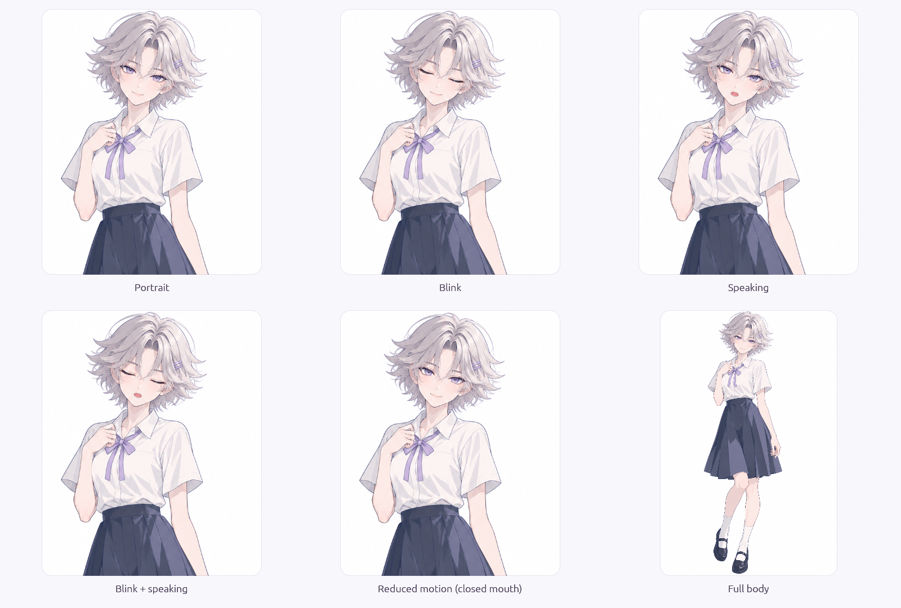

# 图片外形包

AIex 的图片角色可以使用自己的立绘和表情图片，独立于 VTube Studio。外形包只决定视觉表现，不改变角色身份、模型、声音或记忆。当前支持文件夹形式的 PNG/JPEG 包，尚未提供压缩包导入、在线下载或图形化包编辑器。

## 先看内置人物

0.7.0-alpha.1 内置两位人物。双击程序，选择“先体验外形”，展开“外形与自定义图片”即可切换人物；不需要创建文件夹、下载模型或导入素材。

| 人物 | 展示与表现 |
| --- | --- |
| 01 · 一号人物 | 项目作者的 OC，默认选中；原始主立绘支持半身/全身，独立局部贴层提供眨眼与说话，其他情绪使用状态文字提示 |
| 02 · 初始伙伴 | 保留 0.6 插画；八张同画幅素材提供陪伴、眨眼、说话、思考与四种情绪，以固定主体与局部表情贴层显示 |

选择一号人物时，离线预览可展开“OC 素材册”，查看正式立绘、六表情参考和四张动作图。六表情是整张参考图；动作图是独立静态插画，翻看它们不会修改实际外形或驱动对话口型。

两位人物均保留原画背景，以圆角卡片呈现，不是透明桌面悬浮人物。细微呼吸和离散局部贴层不是 Live2D、骨骼或实时五官变形。舞台配色仅调整装饰，不重新绘制人物和服装。人物选择与 OC 构图可随[场景](SCENE_PACKS.md)保存；旧 v1 场景继续使用初始伙伴。



上图依次为半身、眨眼、说话、眨眼与说话、减少动态、全身。主立绘保持一致，眼口贴层只覆盖各自局部。

自己的 PNG 透明背景会按透明度绘制，JPEG 则保留画面背景。内置人物与自定义图片包共用角色身份和表现状态，切换外形不改变记忆归属。

## 导入自己的图片

正常桌面与离线工作室共用导入功能：预览中展开“外形与自定义图片”，选择“自选图片”，再展开“导入图片外形包”。拖入文件夹/清单，或粘贴路径后点击“导入 / 重新加载”。可以调整显示大小，或启用“减少动态效果”。

### 开发者示例

仓库提供一个 Rust 示例生成器，生成带透明背景的原创蓝色伙伴及七张状态图片，不依赖模型或网络服务。目标目录必须不存在，已有目录不会被覆盖：

```powershell
cargo run --manifest-path "crates/ai-ex-desktop/Cargo.toml" --example create_image_pack -- "my-image-character"
cargo run --manifest-path "crates/ai-ex-desktop/Cargo.toml" -- --preview --appearance-pack "my-image-character"
```

`--appearance-pack` 仅与 `--preview` 一起使用。可以传入文件夹，也可以传入 `appearance.toml` 的完整路径。命令行预览先校验包，失败时报告错误并退出。

## 制作自己的外形

建立一个文件夹，放入 `appearance.toml` 与图片。最小清单只需要一张默认图：

```toml
schema_version = 1
id = "my.friend"
name = "我的伙伴"
author = "你的名字"
license = "填写图片的使用与分享条件"

[images]
default = "images/neutral.png"
speaking = "images/talking.png"
listening = "images/listening.png"
thinking = "images/thinking.png"
happy = "images/happy.png"
happy_speaking = "images/happy-talking.png"
blink = "images/blink.png"
```

`default` 必须存在。其他行按需添加；声明了某张图片却缺少文件时，整个候选包会被拒绝。只有完全没声明的状态才会采用回退，因此拼错文件名不会被悄悄忽略。

`schema_version` 是清单协议版本，当前只接受 `1`；`id` 是稳定标识，允许英文字母、数字、点、短横线和下划线。名称必填，作者与使用条件可选。图片作者的使用条件仍需自行确认。

| 图片键 | 触发方式与回退 |
| --- | --- |
| `default` | 普通陪伴、缺少对应图片，以及停止/打断/故障时的默认姿态 |
| `speaking` | 语音播放中嘴部张开；没有对应情绪说话图时使用 |
| `listening`、`thinking` | 倾听或思考状态；缺少时使用情绪图，再回退默认图 |
| `happy`、`sad`、`angry`、`surprised` | 对应情绪的闭嘴/静态姿态 |
| `happy_speaking` 等四种情绪的 `_speaking` | 对应情绪且正在张嘴，优先于通用说话图 |
| `blink`、四种情绪的 `_blink` | 闭嘴时短暂眨眼；先选情绪眨眼图，再选通用眨眼图 |

同一包的图片最好使用相同画布、人物位置和透明背景，避免切换时跳动。显示时按比例缩放，不拉伸图片；自定义图片包当前尚无图片层叠、嘴部独立图层、骨骼变形或动画序列。内置人物的局部帧叠加属于其专用渲染，不改变此包格式。

## 与声音和状态协调

正常服务连接下，说话图片跟随原生播放器报告的口型幅度，静音段回到闭嘴姿态。没有启用真实音频播放时，不会仅因模型生成文字就持续张嘴。离线工作室使用示意口型，方便手动预览。

断线或事件不同步时显示变暗的默认图；停止、打断和故障会停止嘴部变化。外形只消费表现状态，不请求合成、不重新发起对话。缺少表情图片时，默认图仍可作为纯立绘使用。

## 保存与失败处理

导入在后台读取和解码，全部成功后才替换已加载外形；损坏图片、缺图或不支持的版本不会替换当前有效图片包。首次尚无图片包时显示内置伙伴作为占位。导入过程中选择其他外形，任务完成后不会强制切回图片角色。

正常关闭时保存成功导入包的路径、图片角色选择与显示大小。重新打开后按该路径加载；失败的候选路径不会覆盖成功路径。包仍引用原文件夹，不复制到内部素材库；移动或删除文件后需重新导入，修改图片后点击“重新加载”。离线工作室与正式桌面共用外形偏好，从预览进入聊天会沿用选择。

## 资源边界与验证

- 清单最多 64 KiB，最多 24 个图片映射；只接受已定义的图片键。
- 图片路径使用 `/` 分隔，必须位于包目录内；拒绝绝对路径、父目录跳转、URL、Windows 备用数据流，以及解析后指向包外的路径。
- 每个图片文件最多 4 MiB，全包编码后图片最多 32 MiB；单图最大 2048 × 2048，总像素最多 16 × 1024 × 1024。内存还包含解码过程、纹理和界面开销，不应把像素预算当作完整进程内存上限。
- 文件扩展名与实际内容均需属于 PNG/JPEG；不运行包内代码，不自动访问网络。

验证范围包括清单版本与路径、缺图和大小边界、PNG/JPEG 解码、口型对应的纹理选择、打断/断线回退、后台导入失败与偏好重载。当前版本的实际验收记录见[版本说明](releases/0.6.0-alpha.1.md)。原生文件拖放的完整交互和真实语音长时间联动仍需实机验收。
