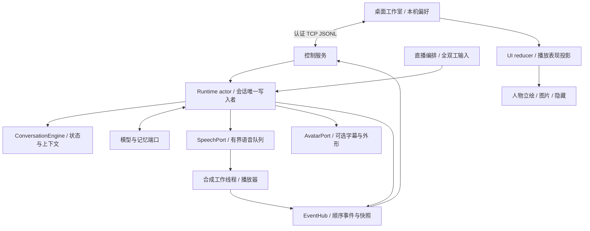
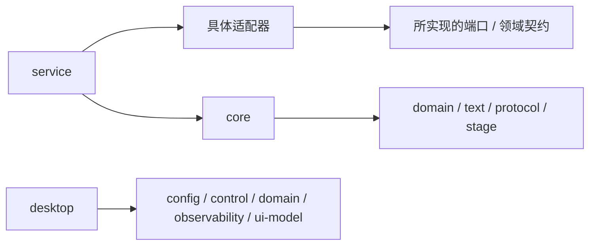

# 当前架构与扩展边界

本文描述 0.6.0-alpha.1 的数字伙伴工作室架构。当前增量集中在内嵌插画与桌面布局，运行时、记忆管理和控制协议继续保持独立。未来设计见[演进路线](DIGITAL_HUMAN_ROADMAP.md)，验收入口见[整体验收流程](MANUAL_TEST_PLAN.md)。

## 1. 运行结构与状态归属



这是运行时数据流，箭头不表示 Cargo 依赖。`ai-ex-service` 是组合根，选择模型、装配端口、启动工作线程和控制服务；桌面不实例化模型或音频设备。离线工作室独立运行，只展示本地预览。

便携分发层只负责启动与装配：`AIex.exe` 通过同目录标记选择 `data` 配置，欢迎页决定进入离线预览或连接设置。进入对话后仍由独立服务持有运行时。程序根据自身位置选择工作目录，从快捷方式或其他目录启动也能定位包内配置；显式传入 `--config` 时保留源码模式的路径语义。托管服务日志写入 `data/logs/service.log`，生命周期仍由桌面的管道管理。打包脚本只复制明确列出的分发文件，不扫描个人配置与记忆目录。

桌面内部按职责组织：

| 模块 | 职责 |
| --- | --- |
| `main` / `session` / `navigation` | 参数、页面切换、配置与本次进程凭据、服务和客户端装配 |
| `app` / `app_layout` / `app_chat` / `app_theme` | 事件归并、页面布局、输入和消息显示、字体与配色 |
| `worker` | 独立读轮询与命令发送、优先控制、事件补齐与恢复 |
| `memory_panel` / `memory_panel_ui` | 当前角色的记忆列表、笔记草稿、修改确认与异步应答归并 |
| `appearance` / `anime_portrait` | 外形偏好、内嵌插画解码与纹理缓存、状态帧选择与绘制 |
| `appearance_import` / `image_appearance` | 自定义图片包的异步校验、解码、纹理选择和失败保留 |
| `welcome` / `preview` / `setup_view` | 首次入口、离线人物舞台、连接表单与固定底部操作区 |
| `character_library` / `scene_files` / `scene_resume` | 角色收藏、资源包读写、按连接范围恢复组合 |

预览和聊天使用相同应用存储标识，共享外形偏好。页面退出的导航请求本身不启动服务；离线预览不创建模型、网络客户端或声音设备。聊天窗口持有自己启动的子进程并检查它是否提前退出，外部服务只建立控制连接。

默认 PNG 插画通过 `include_bytes!` 编译进桌面程序，解码结果与 GPU 纹理按生命周期缓存，不在每帧重新读文件。内置插画使用浅色底圆角卡片与局部表情状态帧；自定义 PNG/JPEG 包仍通过原有导入流程校验和显示。素材和画面样式不进入核心运行时，旧场景、角色身份与外形偏好沿用原协议。

| 状态 | 所有者 | 修改规则 |
| --- | --- | --- |
| 活动回合、短期历史、系统提示 | `ai-ex-core` 的 Runtime / Engine | actor 串行处理；活动回合拒绝切换角色 |
| 长期记忆与当前身份范围 | `ai-ex-memory` | 按 `profile_id` 筛选，记录来源与修改版本；切换等待已开始的存储操作 |
| 语音取消代次、当前播放 | `ai-ex-audio` 与服务播放线程 | 旧代次作废；播放状态由设备进度产生 |
| 事件顺序与快照 | `ai-ex-observability` | 串行分配序号、更新快照并广播 |
| 服务人格快照与命令应答 | 服务控制后端 | 对应命令成功后确认；不由桌面草稿推断成功 |
| 编辑草稿、收藏、外形、启动组合 | `ai-ex-desktop` | 草稿与已应用内容分离；资源校验和服务确认后切换 |

## 2. 模块地图

核心 workspace 有 30 个包；桌面是第 31 个受架构检查的包，有独立清单和锁文件。

| 职责 | 实际包 | 主要边界 |
| --- | --- | --- |
| 类型与契约 | `ai-ex-domain`、`ai-ex-protocol` | 领域类型无 I/O；通用协议封装依赖领域类型 |
| 配置与资源清单 | `ai-ex-config` | TOML、角色/外形/场景校验；桌面负责图片解码和绘制 |
| 对话编排 | `ai-ex-core`、`ai-ex-text` | 状态机、端口、取消与分句；不依赖具体网络/设备实现 |
| 模型 | `ai-ex-deepseek`、`ai-ex-ollama`、`ai-ex-koboldcpp` | 实现模型端口，处理流协议和取消 |
| 记忆 | `ai-ex-memory` | 本地 JSONL、分类与身份隔离、检索、带版本检查的单条管理 |
| 表现与声音 | `ai-ex-stage`、`ai-ex-vts`、`ai-ex-stage-obs`、`ai-ex-audio`、`ai-ex-tts` | 舞台能力路由、可选外形、语音队列、合成及播放 |
| 语音输入 | `ai-ex-duplex`、`ai-ex-asr`、`ai-ex-capture` | VAD/输入契约、HTTP 转写、可选原生采集 |
| 直播与回放 | `ai-ex-event-bus`、`ai-ex-bilibili`、`ai-ex-simulator` | 直播领域事件、连接与离线模拟；与运行状态事件区分 |
| 扩展与动作 | `ai-ex-plugin`、`ai-ex-vision`、`ai-ex-safety`、`ai-ex-automation`、`ai-ex-audit` | 插件协议、只读观察、能力许可、动作编排和审计 |
| 观察与控制 | `ai-ex-observability`、`ai-ex-control`、`ai-ex-ui-model` | 运行状态事件、认证控制协议、框架无关的 UI 投影 |
| 入口 | `ai-ex-service`、`ai-ex-migrate`、`ai-ex-desktop` | 服务装配、旧配置迁移、独立桌面 |

源码入口：[运行时](../crates/ai-ex-core/src/runtime.rs)、[端口](../crates/ai-ex-core/src/ports.rs)、[服务装配](../crates/ai-ex-service/src/main.rs)、[桌面入口](../crates/ai-ex-desktop/src/main.rs)。仓库没有统一名为 `ai-ex-adapters` 的包。

## 3. 依赖方向与执行检查

以下箭头表示“左侧包依赖右侧包”：



网络、音频设备、窗口和具体后端不进入领域层。适配器按自身需要依赖契约，不要求全部依赖 core。桌面允许复用配置、客户端和投影类型，但不能直接依赖 core、service 或具体适配器。

[架构检查脚本](../tools/check_architecture.ps1)读取两个 Cargo 清单的真实元数据，与逐包允许列表比较。新增包需登记允许依赖；本轮已将独立桌面纳入检查，并使脚本可从其他工作目录执行。

```powershell
pwsh -NoProfile -File tools/check_architecture.ps1
pwsh -NoProfile -File tools/check_architecture.ps1 -ProbeViolation
```

第一条应成功并报告 31 个包；第二条在内存中的元数据注入领域层/桌面反向依赖，**应退出 1**。探针不修改 Cargo 文件。该检查约束内部包依赖，不能替代运行时测试、代码评审或进程隔离。

## 4. 一轮对话的完整流转

1. 桌面发送带令牌的命令；服务校验输入并等待 Runtime 确认可执行或已排入有界队列，再返回接受应答。队列满会直接拒绝；接受命令不代表模型已完成回答。
2. Runtime 创建回合 ID，取消旧语音，检索当前角色的记忆，再构建模型上下文。
3. 模型流经情绪前缀解析和分句；文本事件发布到快照，语句进入有界语音队列。
4. 播放线程合成并播放，报告语句 ID、情绪和播放进度。桌面从实际播放状态绘制字幕与口型。
5. 生成完成后提交完整回答到记忆。生成结束与声音播放结束是两个独立时刻。
6. 打断取消未完成生成和旧语音代次，回滚未完成回合的短期历史；已开始的持久写入会继续完成。

模型、召回、排队与末尾分句等待都处于可取消范围。单次语音/模型取消及外形调用采用 250 毫秒异步等待上限。语音先停，外形后清理；失败产生诊断事件，下一轮可重试。同步阻塞适配器、事件发布和存储写入不受这个上限统一约束。

StageRouter 依据 `Speech` 能力分组清理；外形扩展应与语音执行器分开。VTS/OBS 尚未接入原生播放时间线，仍消费生成时的舞台动作。详见[声音与表达](SPEECH_PRESENTATION.md)。

桌面不能仅用快照序号推进聊天游标：快照不携带正文。周期刷新先补拉事件到目标序号；若事件已经更新到更晚的位置，丢弃旧快照。事件服务的 `instance_id` 区分不同运行实例，避免新实例序号追平时误认旧历史。短断线沿用游标补齐，缓冲区缺口或实例变化则明确提示历史不完整，保留已显示文字并结束旧流状态。普通命令排队与合并后的打断/急停分别调度，关闭桌面取消网络等待；结果未知的请求不自动重发。

`PresentationAnimator` 位于 `ai-ex-ui-model`，每个外形实例保存自己的瞬时表现状态。动画参数与具体绘制分离：默认插画取局部表情状态帧并做细微呼吸，自定义图片包选择清单中的离散图片；保留的几何绘制工具可消费连续五官参数。静音、失同步、断线、打断和减少动态不保留说话帧，不延长旧音节。该历史不落盘，不生成主动行为，也不修改用户图片资源。

## 5. 角色、包与数据边界

- **身份**：`profile_id` 决定记忆归属；名称、外形和场景 ID 不代替身份 ID。
- **设定版本**：`revision` 标识设定版本。收藏检查同身份/版本冲突；服务尚无基于旧版本的并发编辑事务。
- **角色包**：独立设定快照；模型和设备由运行配置提供。
- **外形包**：包内图片和状态映射；不持有会话逻辑，不执行包内代码。
- **场景包**：当前已应用的角色、外形和偏好组合；图片随包复制，私人记忆和服务凭据不导出。
- **启动组合**：桌面本机快照，按配置绝对路径与控制地址区分；复用已有服务时先预览确认。

导入先校验版本、资源路径、大小和图片内容，再进入确认流程。连接超时可能导致客户端无法确定服务是否已应用，此时保留本地外形并提示重新确认；没有跨进程事务回滚。持久记忆存在本机，召回内容会随请求发送到用户选择的模型。

### 记忆管理的数据流

桌面通过控制协议提交 `MemoryRequest`，Runtime actor 负责与回合、角色切换和停止请求协调，再通过 `MemoryPort::manage` 调用存储；桌面不直接读取或改写 JSONL。活动回合期间拒绝管理，桌面还会等实际播放结束。列表只读；新建、更正、遗忘完成持久写入后，再清空当前短期上下文并停止旧表现。桌面以成功应答为准清空聊天显示，保留聊天输入草稿。

应答 `MemoryReply` 同时返回结果与执行后的运行快照。确认修改成功时，桌面检查服务实例并把快照序号作为已清理对话的边界，拒绝迟到旧事件重建聊天；不会用较早快照倒退当前序号。列表应答中的快照不推进聊天游标，避免跳过尚未收到的正文。协议结构与分页预算见[控制协议](CONTROL_PROTOCOL.md)。

所有请求校验 `profile_id`；更正和遗忘同时校验记录 ID 与 `expected_revision`，防止旧页面覆盖较新的记录。记录的 `revision` 与角色设定版本彼此独立。持久修改先写入并同步同目录唯一临时文件，再替换原文件；失败时不把内存列表提前改成成功状态。该边界针对单个服务进程，不提供多个独立进程共同编辑文件的事务保证。

记录来源分为自动记录、用户笔记和用户更正。确认笔记优先参与当前角色召回，仍受总条数限制；自动记录按相关性选择，不视为已确认事实。列表独立支持关键词、分类和分页；超长单条通过 `truncated_ids` 明确表示只传输了片段，查看不会截断原始文件。

桌面为每次操作分配请求 ID，切换角色后丢弃不再匹配的旧应答；笔记草稿按角色暂存。写入结果未知时保留草稿并要求先刷新核对，禁止自动重发。单条删除不会查找其他记录或角色设定中的同义信息，完整历史恢复与概念级遗忘仍未实现。面向用户的完整边界见[记忆工作台](MEMORY_WORKSPACE.md)。

## 6. 生命周期与后续扩展

桌面启动的 `--managed` 服务由专用管道维持，关闭桌面请求退出；桌面最长等待 8 秒，超时只终止自己持有的服务进程。`--serve` 可独立运行，复用它的桌面关闭时不终止它。配置修改在服务重启后生效。

扩展时优先沿用现有契约：模型实现 `LanguageModelPort`，存储实现 `MemoryPort`，舞台实现 `StageExecutor`，新输入向运行时提交意图。网页/3D 应消费版本化表现协议，不复制会话核心；目前尚无浏览器桥接，不应把当前 TCP 端口当作浏览器接口。

后续重点仍是跨载体播放同步、声音/行为组合、连续关系记忆和更完整的恢复机制。当前版本不为这些概念增加空模块；先按验收流程验证现有链路，再根据实际失败场景调整职责。
