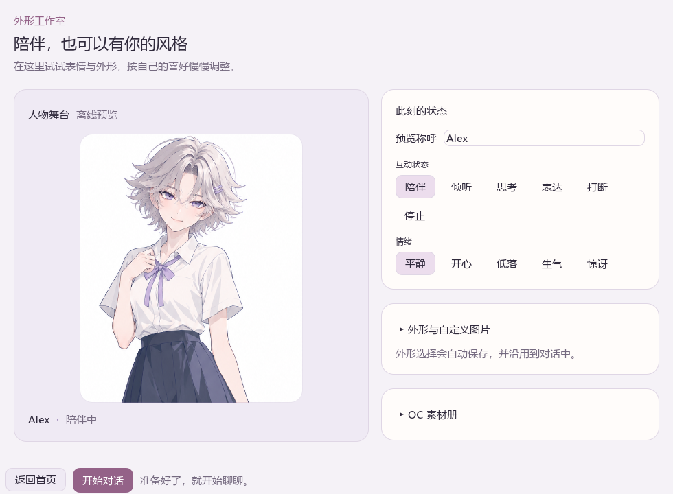

# AIex 桌面端快速使用

普通使用请先看[Windows 便携版](PORTABLE_WINDOWS.md)：完整解压后双击 `AIex.exe`。整体测试从[界面体验清单](MANUAL_TEST_PLAN.md)开始；分层与状态归属见[架构说明](ARCHITECTURE.md)。下文同时保留源码开发入口。

本文适用于 0.7.0-alpha.1：默认内嵌 OC“一号人物”，提供人物选择、半身与全身构图，以及独立素材册。暖白淡紫界面、初始伙伴、记忆页和角色组合继续保留。

AIex 提供两种入口：普通用户使用可视化首次设置向导；开发者可以继续使用命令行、配置文件和终端日志。桌面端只通过本地 control 协议连接 `ai-ex-service`，不会直接持有模型、VTS 或音频对象。

| 使用方式 | 入口 | 能看到什么 |
| --- | --- | --- |
| 普通用户 | 直接启动桌面端 | 向导、连接状态、对话、模型/VTS/TTS 健康、急停 |
| 开发者 | 在“设置与诊断”勾选“显示详细诊断”（可选 `--developer` 默认展开） | 桌面事件日志、控制协议错误；服务原始日志另见终端或便携日志文件 |

## 第一次打开

便携版双击 `AIex.exe`，欢迎页可直接进入离线外形体验，也可连接模型。配置在包内 `data`，后台服务已包含，无需构建。



外形预览无需模型，底部“开始对话”可直接进入连接设置。先用这几步体验人物：

1. 展开“外形与自定义图片”，选择“内置立绘”。可随时切换“01 · 一号人物”和“02 · 初始伙伴”。
2. 选择一号人物，试试“半身近景”和“全身立绘”。人物选择与构图会保存并沿用到聊天，不会改变人格或记忆。
3. 向下展开“OC 素材册”，查看“正式立绘”“表情参考”“欢迎”“专注”“完成庆祝”“温柔鼓励”。这些是静态素材，查看不会应用到舞台；六格表情板保持完整，不作为动画播放。素材册会记住上次选择。
4. 缩小窗口后向下滚动，仍可找到人物设置和素材册；底部“返回首页”与“开始对话”固定可用。

“自选图片”可导入自己的图片包，“隐藏外形”保留对话和声音；舞台点缀只调整装饰。新保存的一号人物场景会记录人物与构图；旧 v1 内置场景恢复初始伙伴。完整场景包含角色设定，仍需预览并确认后应用。

源码用户可双击仓库根目录的 `AIex-Desktop.cmd`。它优先启动 `crates/ai-ex-desktop/target/release` 或 `crates/ai-ex-desktop/target/debug` 中已构建的桌面端；没有二进制时才调用 Cargo。无参数启动同样显示欢迎页。

开发者可以双击 `AIex-Desktop-Developer.cmd`，让诊断面板默认展开；桌面端日志和服务原始 stdout/stderr 可以同时查看。

源码开发时也可以使用：

```powershell
cargo run --manifest-path "crates/ai-ex-desktop/Cargo.toml"
```
当配置文件不存在时，AIex 会自动打开“首次设置”窗口；已有配置可用 `--setup` 重新编辑。桌面按配置中的 `control.token_path` 读取令牌，缺失或无效时报告错误，不会因为找不到同目录默认令牌而重写已有配置。

1. 选择 DeepSeek、KoboldCpp 或 Ollama。
2. 确认模型地址和模型名称。
3. DeepSeek 粘贴 API Key（密钥只在本次进程中使用，不写入配置文件），或提前设置 `DEEPSEEK_API_KEY`。
4. 可选勾选 Bilibili 直播事件，填写房间号和 Cookie 环境变量名（只填变量名，不粘贴 Cookie）。
5. 填写角色名称，点击“保存并进入 AIex”。
6. 点击“检查连接”可提前检查地址和本地服务端口；HTTP 本地服务会读取状态码，HTTPS 云服务先检查网络端口，完整 API 鉴权由服务启动时再次验证。

源码默认向导创建 `config/ai-ex.local.toml` 和 `config/control.token`；便携版更新 `data/ai-ex.local.toml` 并创建 `data/control.token`，已有有效令牌保持不变。
连通性检查不会保存 API Key；向导生成的配置只保存环境变量名，密钥仍通过当前进程或环境变量传递。勾选“打开 AIex 时自动启动服务”后，该选择会保存在配置中。桌面优先复用通过令牌验证的已有服务；需要启动时，优先使用旁边的 `ai-ex-service.exe`，源码环境缺少该文件时先构建再直接启动。源码构建启用音频输入/输出 feature，设备是否启用仍由配置决定。便携版服务日志保存在 `data/logs/service.log`；源码模式保留原始终端输出。

### 服务随桌面运行

桌面自动启动的服务使用 `--managed`：桌面保留一条专用生命周期管道，关闭窗口或桌面进程退出后，服务收束当前回合与语音并退出。正常关闭最多等待 8 秒，超时后只终止这个桌面自己启动的服务，不按进程名称批量结束其他实例。

已有配置时，需要桌面再次启动并管理服务，可运行：

```powershell
cargo run --manifest-path "crates/ai-ex-desktop/Cargo.toml" -- --start-service
```

启动偏好保存在 `[desktop] auto_start_service = true/false`，旧配置缺少此字段时默认不自动启动。`--start-service` 为本次启动启用自动启动，`--connect-only` 为本次启动禁用它；二者不能同时使用。已有服务通过认证后直接复用，关闭桌面不会终止它；地址已占用但认证失败时报告错误，不启动重复实例。云端密钥仍需在新进程环境中提供，已有配置的自定义密钥环境变量名会保留。

重新打开设置会恢复已有模型、角色名、直播输入与启动偏好。保存保留未编辑的人格、记忆、插件等配置和未知扩展字段；修改角色名会增加人格版本。已有有效令牌不轮换；缺失令牌可在显式保存设置时新建，无效令牌不会被覆盖。新建配置的令牌使用绝对路径；旧配置中的相对路径继续相对于启动工作目录解释，服务与桌面使用相同规则。

配置先校验，再写入同目录临时文件并同步，最后替换目标；检测到文件已被其他编辑器修改时拒绝保存，目标被占用时保留原文件。TOML 会重新排版，注释不保留；此流程不是多进程配置编辑事务。复用中的服务不会自动重新加载文件，更改运行设置后需重启该服务应用。

需要服务独立于桌面持续运行时，在另一个终端中使用：

```powershell
cargo run -p ai-ex-service -- --config "config/ai-ex.local.toml" --serve
```

`--serve` 忽略标准输入关闭，以 Ctrl+C 请求正常退出；`--managed` 是提供给父进程的模式，标准输入管道关闭即请求退出。两者都要求启用本地控制端，且不能与检查、回放、单次提问模式组合。普通交互模式继续支持 `/quit`，空行现在只会被忽略。

同一控制地址只运行一个服务。旁置发布程序需要同步升级桌面与服务，旧服务不认识新增运行参数。源码回退构建可能耗时，进度显示在原始终端；发布环境应将服务程序放在桌面程序旁边。

自动验收范围包括启动偏好、自定义令牌、已有服务认证、配置保留与冲突检测、图片解码、状态回退、启动组合和记忆管理。具体验证结果以[版本说明](releases/0.7.0-alpha.1.md)为准；真实模型与音频设备、独立服务关闭和整机重连请按[整体验收流程](MANUAL_TEST_PLAN.md)记录实际结果。

外形面板支持一号人物、初始伙伴和自定义图片角色，也可隐藏外形。内置插画包含在程序内，显示为浅色底圆角卡片；无需选择文件。舞台配色只影响装饰，不改变人物服装。自己的 PNG/JPEG 图片可通过文件夹包导入，详见[图片外形包](APPEARANCE_PACKS.md)。

## 普通用户界面

主窗口分为“聊天 / 角色与外形 / 场景组合 / 记忆 / 设置与诊断”。聊天页把对白、输入框与人物舞台分成独立区域，窄窗口可折叠人物；输入区固定在下方，支持 Enter 换行、Ctrl+Enter 或按钮发送。角色页分别展示外形工作室与相处方式，窗口较窄时上下排列。设置页集中展示模型、组件与诊断信息，也能返回首页或打开连接设置。

离线预览中，“此刻的状态”调整情绪与互动状态。一号人物使用局部眨眼、说话帧与半身近景的细微呼吸；素材册中的表情和动作尚未作为对话情绪自动应用。初始伙伴保留原有的不同情绪表现。口型是离散状态帧，不是实时面部变形；静音、断线、打断和减少动态效果不保留说话帧。正式对话的口型依据实际播放，延迟仍需按验收流程检查。

Provider 健康详情会区分鉴权失败、接口地址不存在、请求受限、服务端故障、超时和无法连接；看到这些文字时，优先按提示检查 API Key、模型地址、模型进程或网络。
如果服务提供标准模型清单，健康状态还会检查配置模型：Ollama 会提示是否需要 `ollama pull`，DeepSeek 会提示模型名称或账户权限问题；非标准兼容服务会显示“未能验证模型”，不会直接假装模型可用。服务重启后桌面端会自动重连；检测到事件序号缺口时会请求状态重同步。
连接保持后，桌面端按约 50 毫秒间隔尝试同步事件，并每约 2 秒刷新一次组件健康状态；请求延迟会影响实际刷新频率。急停状态优先保留，不会因为重连显示“假连接”。 OBS 断线后服务会在动作或健康探针触发受控重连，桌面会显示重连中/失败/恢复详情。 Bilibili 启用后也会显示连接中、已连接、断线和重连失败详情；关闭时不显示误导性的红色平台状态。 每次状态变化还会进入同一条有序事件流，因此开发者诊断日志可以回放“何时、哪个组件、为什么变化”，不会只看到轮询后的最终状态。
Bilibili 事件会在开发者日志中显示“已接受”和“反应建议”。向导生成的配置默认不自动反应；需要高级测试时再手动设置 `bilibili.response_mode = "automatic"`（旧配置也可用 `auto_react = true`），并保留急停和冷却限制。
“角色与外形”页中的“角色设定与收藏”可编辑档案 ID、版本、名称、语气、系统提示词、禁忌和直播模式。点击“预览并请求确认”后进入确认窗口；确认后才发送 `set_persona`，服务拒绝或活动回合冲突时不会替换当前角色。切换不同档案后，本次聊天视图随短期上下文重新开始；同档案编辑保留对话。外部命令行切换通过事件流同步回桌面。
开发者诊断会记录角色草稿、确认、应用结果、版本变化和失败原因；需要原始细节时，同时查看启动服务的终端输出。

## 直接管理共同经历

在“设置与诊断 → 连接设置”勾选“启用长期记忆”，保存后重启对应服务。关闭该选项不会删除已保存记录；记忆保存在本机，参与对话的片段会发送给选用的模型。新配置默认启用，重新编辑时尊重已有选择。

连接并同步角色后，打开“记忆”。可以先查找现有记录，或展开“记下一件事”，填写笔记并点击“记住这件事”；点击“更正”会自动展开编辑器，不再需要的单条记录可“遗忘”并核对确认。自动记录与用户明确笔记分开标注，较长记录会明确显示为片段。完整操作见[记忆工作台](MEMORY_WORKSPACE.md)。

新建、更正和遗忘成功后，当前短期上下文与聊天显示重新开始，聊天输入草稿保留。下一轮优先召回当前角色的确认笔记，但仍受条数上限限制。相同信息在其他记录或角色设定中需要分别处理；单条遗忘不会清除全部同义信息。

回复或播放尚未结束时先等待或打断，保存期间暂缓新聊天和角色切换。写入结果未知时，界面保留笔记草稿，先刷新核对，不能直接重发。切换角色后的旧响应不会替换新角色列表，未保存笔记按角色在本次会话中分别保留。

重新启动可继续使用同一档案 ID 的持久记忆；完整聊天显示与全部短期历史恢复尚未实现。约五分钟的手动检查见[整体验收流程](MANUAL_TEST_PLAN.md)。

## 开发者模式：可视化日志 + 终端原始日志

需要分析控制协议或排查问题时执行：

```powershell
cargo run --manifest-path "crates/ai-ex-desktop/Cargo.toml" -- --developer
```

桌面默认显示聊天页。到“设置与诊断”打开开发者诊断，可以查看连接变化、健康快照、事件数量、控制命令和失败信息；源码启动终端保留 `ai-ex-service` 的 stdout/stderr，便携版使用 `data/logs/service.log`。`--developer` 让诊断内容默认展开。

Developer stage replay is available with --replay-stage PATH; the service validates version, sequence, and action capability before printing replay logs.
示例回放文件位于 `config_examples/stage-replay.jsonl`，可执行：

```powershell
cargo run -p ai-ex-service -- --config config/ai-ex.example.toml --replay-stage config_examples/stage-replay.jsonl
```

开发者诊断下的“舞台/OBS 动作遥测”面板会显示服务最近的舞台动作摘要（schema、序号、类型和受限 detail），包括语音、字幕、口型、表情、Stop 等；它是只读观察，不会因为查看而触发 OBS。

视觉/游戏 dry-run 回放：

```powershell
cargo run -p ai-ex-service -- --config config/ai-ex.example.toml --replay-automation config_examples/automation-replay.jsonl
```

该命令只记录动作并生成确定性屏幕帧，不会移动真实鼠标或启动进程；每个动作仍会写入 `logs/automation-audit.jsonl`。

也可以显式指定配置：

```powershell
cargo run --manifest-path "crates/ai-ex-desktop/Cargo.toml" -- --config config/ai-ex.local.toml --developer
```

## 高级命令行流程

需要完全控制进程和配置时，仍可手动执行：

```powershell
pwsh -NoProfile -File tools/create_control_token.ps1
$env:DEEPSEEK_API_KEY = "sk-你的密钥"
cargo run -p ai-ex-service -- --config config/ai-ex.desktop.example.toml
cargo run --manifest-path "crates/ai-ex-desktop/Cargo.toml" -- --config config/ai-ex.desktop.example.toml
```

也可以复制 `config/ai-ex.desktop.example.toml` 后修改模型或地址。配置中的 `token_path`、`bind` 和桌面端参数必须一致。令牌文件只存在于本机，不要提交到 Git；需要轮换时显式使用 `-Force`。

## 启动前检查

服务可先执行配置加载与组件健康检查（会访问已配置的外部服务）：

```powershell
cargo run -p ai-ex-service -- --config config/ai-ex.desktop.example.toml --check
```

DeepSeek 未配置时会明确报告 `DEEPSEEK_API_KEY` 缺失；VTS、TTS 和记忆在样例中默认关闭，因此不要求安装这些外部服务。

### 诊断导出与新手提示

开发者诊断面板支持关键词筛选，并可点击“导出日志”写入桌面启动目录的 aiex-desktop-diagnostics.log。导出内容只来自桌面已收到的诊断行，适合提交问题时保留本地证据。服务未连接时，聊天区会显示连接状态并保留输入草稿；设置中可勾选“打开 AIex 时自动启动服务”。

### Provider 配置提示（Phase 32）

首次设置会根据 DeepSeek、KoboldCpp、Ollama 显示不同的依赖提示：云端 DeepSeek 需要 DEEPSEEK_API_KEY；KoboldCpp 需要先启动本地 5001 端口服务；Ollama 需要先运行本地服务并安装模型。模型名称仍可自由编辑，桌面不会擅自替换模型。主界面的“模型 Provider 诊断”会显示当前 Provider 的健康详情和下一步处理方向。

### 人格、记忆与安全状态（Phase 33）

主界面的“人格、记忆与自动化策略”面板只读展示当前人格版本、直播模式、记忆是否启用及安全门状态。人格修改仍必须经过确认；记忆和自动化不会因为打开面板而改变，急停状态会优先显示。

### 舞台能力与回放（Phase 34）

开发者诊断中的“舞台/OBS 动作遥测”现在还会显示服务声明的舞台能力。能力来自 StageRouter，而不是桌面推测；旧服务快照没有能力字段时会明确显示“尚未同步”。舞台动作仍可通过 dry-run 记录和回放，默认不会执行任意桌面控制。
