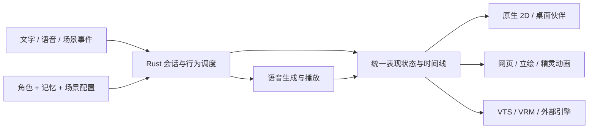

# AIex 数字人演进路线

目标是一个人格连续、记忆可管理、表达协调、外形可替换的数字人运行时。Rust 负责核心状态、调度和平台适配；外部模型及渲染引擎通过协议接入。VTube Studio 是可选载体之一。

本文是后续产品与实施计划的主入口，更新于 2026-09-07。下面的目标、模块契约和里程碑属于待实施设计；“当前落地”仅说明当前代码中的基础，不能代替完整交互验收。历史迁移记录继续保留在 [技术基线](CORE_TECHNICAL_BASELINE.md)。

本轮交付点为 [0.4.0-alpha.1 人物与对话工作室](releases/0.4.0-alpha.1.md)：在便携 EXE 基础上整理页面与启动职责，重画人物立绘，补齐发送确认、事件恢复与服务实例识别。发布后按用户要求停止本轮开发，交由用户整体测试。这是阶段交付，不代表整个数字人路线已经完成。

## 产品目标：同一个角色，多种存在方式

用户能够创建一个角色，为它选择人格、声音、外形、记忆空间和行为习惯，再保存为桌面陪伴、直播或工作辅助等场景。角色在不同场景与载体之间保持身份连续；用户也能明确选择隔离的角色和记忆。

“像数字人”的体验由以下可观察行为构成：

- 有连续的身份：称呼、表达风格、偏好和共同经历保持一致，重启后仍能延续。
- 会听也会停：区分听取、思考、说话与等待；用户插话时及时让出话轮。
- 表达有因果：停顿、目光、表情和动作跟随语义、注意力与正在播放的声音。
- 有适度主动性：能延续未完成的话题、回应场景变化，也能安静陪伴。
- 可以塑造：用户能调节主动程度、话多话少、情绪强度、动作幅度和关系风格，并预览效果。

自然感优先来自连续记忆、响应时机和表达协调。不把随机插话、固定频率的小动作或编造共同经历作为拟人化的验收依据。

## 自由拼接的产品结构

| 可组合单元 | 用户可以定制什么 | 与其他单元的关系 |
| --- | --- | --- |
| 角色包 | 名称、背景、语气、偏好、关系初始设定 | 引用声音和外形预设，不绑定供应商或私人记忆 |
| 声音包 | 合成适配器、音色资源引用、语速、停顿和表达映射 | 不支持某种语音表现时明确降级 |
| 外形包 | 图片/模型/动画资源、配色、服装、动作和参数映射 | 消费统一表现状态，不拥有角色逻辑 |
| 行为包 | 触发条件、响应方式、主动程度、冷却、免打扰 | 向运行时提交意图，不能直接争用麦克风或播放器 |
| 场景包 | 输入来源、输出载体、布局、启用模块与参数覆盖 | 组合角色、声音、外形和行为，允许保存多个方案 |
| 记忆空间 | 经历、事实、关系、可见范围与保留策略 | 按角色和交互对象分区；共享必须显式指定 |

普通使用路径是“选择预设 → 调整表单 → 即时预览 → 保存组合”。进阶使用支持配置文件和插件；节点编辑器放在组合规则稳定后实现，所有编辑方式共享同一份可验证配置。

例如，同一个角色白天可以是安静的桌面小伙伴，直播时使用 VTS 身体与弹幕输入，网页上使用 2D 立绘，另一个场景只保留声音。切换的是表现与行为配置，身份和记忆空间由用户明确决定是否保持。

### 包和配置的约定（设计目标）

1. 包清单声明稳定 ID、包版本、协议版本、依赖、能力、资源清单、作者和资源许可；角色、外形和场景分别导入导出。
2. 配置覆盖顺序固定为：模块默认值 → 包预设 → 场景覆盖 → 本机覆盖 → 本次会话临时调整。界面可查看每个值的来源，并恢复上一级。
3. 导入前校验版本、依赖、资源路径和大小；缺少必需能力时给出具体修复方式，可选能力采用明确的回退方案。
4. 数据包默认仅包含声明和资源。带可执行插件的扩展单独显示运行需求与能力范围，不因导入外形而自动运行代码。
5. 配色与动作幅度可即时预览；模型、声音设备和人格变化在受控切换点应用。先验证新配置，成功后整体切换，失败保留旧配置。
6. 分享包默认排除密钥、控制令牌、本机绝对路径和私人记忆；记忆迁移使用独立的显式导出流程。

## Rust 主导的技术路线

继续复用当前 workspace。Rust 承担会话调度、记忆管理、行为策略、音频生命周期、表现状态、包校验和本地服务；模型推理与专用渲染通过适配器接入。网页载体可以使用浏览器技术，3D 载体可以使用独立渲染进程，业务状态始终由 Rust 运行时管理。



| 现有位置 | 演进职责 |
| --- | --- |
| `ai-ex-domain`、`ai-ex-protocol` | 角色身份、交互对象、表现帧、意图和版本化契约 |
| `ai-ex-core`、`ai-ex-event-bus` | 单一会话所有者、注意力与意图仲裁、取消和场景事件 |
| `ai-ex-stage`、`ai-ex-ui-model` | 统一动作与表现投影、能力协商、不同载体的映射 |
| `ai-ex-audio`、`ai-ex-tts`、`ai-ex-duplex` | 播放时钟、语音分段、抢话、合成取消和输入状态 |
| `ai-ex-memory`、`ai-ex-config` | 记忆分区、来源与纠正、包解析、配置合并和迁移 |
| `ai-ex-control`、`ai-ex-plugin` | 本地控制、外部扩展隔离、浏览器桥接与连接恢复 |
| `ai-ex-desktop`、`ai-ex-service` | 角色工作室、运行诊断、组合装配和服务生命周期 |

先在现有边界完善接口；当包管理、行为调度或表现时间线形成独立职责后再拆 crate，避免为每个概念提前创建空模块。

### 统一表现契约

在已有 `StageAction`、能力声明和 `PresentationState` 上增量演进，避免再建一套互不兼容的动作系统。目标表现帧携带角色/会话/语句 ID、顺序号、取消代次、相对播放时间、活动状态、情绪强度、视线、口型、姿态和字幕线索。

可靠命令与可合并的高频表现帧分开处理：取消和场景切换不能被动画更新挤压，连续口型帧可保留最新值。断线恢复先获取完整快照，再消费后续事件；过期语句和旧取消代次的动作不得重新播放。

载体声明可支持的能力及范围，例如口型、视线、表情混合、骨骼或字幕。原生人物把情绪映射为五官与姿态，图片立绘可切换表情图，3D 身体可映射到骨骼动作。能力不足时使用可见的降级说明。

多载体共享同一运行时和播放时钟。默认仅指定一个音频输出，避免多个身体重复朗读；字幕和动作跟随同一语句。浏览器接入需要单独的本地桥接与来源/会话校验，不能直接把现有 TCP 控制端暴露给网页。

## VTS 之外的外形路线

| 形式 | 计划中的体验与定制 | 实施顺序 |
| --- | --- | --- |
| 原生人物立绘、纯语音 | 在现有原型上补资源化、布局、表情与动作预设 | 第一批 |
| 图片立绘 / PNG 表情组 / 精灵动画 | 用户提供少量图片即可组装角色；编辑锚点、嘴部和状态映射 | 第一批 |
| 网页载体 | 独立预览页和直播叠加层；消费统一表现协议 | 第二批，验证真正跨载体 |
| 桌面悬浮伙伴 | 透明窗口、缩放、拖动、停靠、点击交互和输入穿透切换 | 第二批，独立验收窗口行为 |
| VTube Studio | 保留现有适配器，补齐播放时间线与动作映射 | 随表达协调阶段推进 |
| VRM 3D 身体 | 表情、目光、姿态与动作资源的映射编辑 | 第三批，先单个参考模型 |
| 外部引擎 / 更写实的身体 | 沿用协议接入独立渲染器，再评估高质量面部与身体表现 | 后续扩展 |

先证明“一套人格和记忆可驱动原生与网页两个独立载体”，再投入完整 3D 编辑。写实程度保留自由选择，平面、卡通、抽象和无外形都是正式使用方式。

## 当前落地（2026-09-07）

- 0.4 桌面拆分聊天、角色与外形、场景、设置页面，预览可直接进入对话；启动会话、导航和人物绘制分别维护。中文输入确认、草稿保留、紧急命令与消息补齐都有独立回归验证。服务实例标识区分重启前后的事件，队列真正接纳消息后才确认发送。

- `ai-ex-ui-model::PresentationState` 从运行快照生成与渲染器无关的表现状态。
- 桌面使用包含发型、五官、脖颈、肩膀与服装的原生人物立绘，也支持隐藏外形；配色和减少动态效果偏好通过桌面存储保存。旧版 `orb` 偏好与场景会迁移为人物立绘。
- 内置人物支持呼吸、眨眼、视线和表达状态；不依赖 VTS。
- 图片外形包 v1 已支持 PNG/JPEG 文件夹导入、状态与情绪图片、显示大小和偏好重载；后台校验失败保留原包。图片角色共用真实播放口型与断线回退，提供无需外部服务的 Rust 示例生成器，见 [图片外形包](APPEARANCE_PACKS.md)。
- 断线和事件缺口会抑制过时表情；打断、停止和故障会停止口型动画。
- `--preview` 打开独立外形工作室，无需配置、令牌、模型或外部服务。预览中的称呼和状态不修改正式角色。
- 内置形象的正式口型已接入原生音频能量与播放进度；离线预览仍用示意动画。音素识别、VTS 播放时间线和表情过渡尚未完成，详见 [声音与表达](SPEECH_PRESENTATION.md)。
- 后台服务新增独立运行与桌面托管两种模式。桌面持有服务进程和生命周期管道，退出时正常收束并回收自己的服务；语音合成等待可取消。运行方法见 [桌面使用说明](DESKTOP_USER_GUIDE.md)。
- 启动偏好随配置保存；桌面按指定令牌路径认证并复用已有服务，避免重复启动。重新编辑设置会恢复已有值、保留人格/记忆与扩展字段，并以临时文件替换方式保存；旧配置和令牌不会因为普通启动而被重新生成。
- 角色 ID 已接入运行时和持久记忆：同一角色编辑保留经历，换角色清空短期上下文并切换长期记忆范围。召回、计数、导出与删除按角色隔离，共享写入方随角色切换；旧版未标记记录属于 `default`。具体用法和迁移边界见 [人格与记忆](PERSONA_MEMORY.md)。
- 角色包 v1 已支持独立保存人格、身份、版本和作者信息，桌面提供导入草稿、提示词预览、应用与导出新文件。无效导入不替换草稿，未应用的名字不会出现在当前外形上；提供陪伴与主持示例，见 [角色包](CHARACTER_PACKS.md)。
- [角色收藏](CHARACTER_LIBRARY.md)已提供列表、搜索、新建和独立身份副本，保存设定版本并支持移出后撤销。当前角色和草稿分别显示包/收藏/场景/服务来源；编辑会标记差异。同一身份与版本的不同设定拒绝覆盖，移出收藏不影响运行角色与记忆。

- 场景包 v1 已组合人格快照、内置/图片外形及显示偏好，支持桌面保存新目录、预览后应用和携带图片重载；提供安静陪伴与轻快主持两套示例，见[场景组合](SCENE_PACKS.md)。
- 桌面可记住一份启动组合，按服务配置路径与控制地址隔离；新启动服务时自动请求恢复，已有服务先预览确认。资源、连接与角色确认就绪后才切换外形；失败保留选择且不循环重试，恢复期间暂缓发送新消息。

当前已落地图片外形包、人格角色包及首版场景组合；声音、行为还没有包管理与组合编辑，独立网页/VRM 载体尚未实现。角色间记忆已隔离，仍需补交互对象隔离、记忆来源、纠正和关系连续性。

## 实施顺序与验收

各阶段以下表的验收结果为完成条件，不以新增文件数或演示动画数量判断进度。先交付一个可反复使用的完整场景，再扩大形态与自由度。

| 阶段 | 主要交付 | 通过条件 |
| --- | --- | --- |
| M0 基础运行 | 桌面与后台服务生命周期、重连、故障提示与演示模式 | 从首次设置走通对话、打断、重连和关闭；没有遗留的自启动服务 |
| M1 自由组合基础 | 包清单 v1、角色工作室、图片外形、版本化表现契约 | 创建两个角色与两个场景；修改配色、声音或外形不丢失身份与记忆；错误包不覆盖有效配置 |
| M2 协调表达与跨载体 | 统一播放时间线、语句级字幕/表情、网页载体、VTS 映射 | 同一角色在原生与网页间切换并同步展示；打断后旧语句不再发声或驱动动作 |
| M3 连续人格与记忆 | 来源、可信度、关系记录、纠正与遗忘管理界面 | 重启后记得已确认偏好；纠正与删除影响后续召回；角色之间不串记忆 |
| M4 自然行为 | 注意力、话轮仲裁、主动策略、可复用行为包 | 情境触发能解释；冷却和免打扰有效；主动行为被用户输入抢占 |
| M5 分享与使用体验 | 包迁移、导入导出、依赖诊断、悬浮伙伴与发布包 | 在干净用户环境导入组合并复现；缺失依赖可定位；默认分享不包含私人数据 |
| M6 3D 与扩展编辑 | VRM 参考适配器、动作映射、多载体配置、按需求增加节点编辑 | 同一组标准动作可驱动 2D 与 3D；更换渲染器无需修改对话核心 |

依赖顺序为 M0 → M1 → M2；M3 依赖 M1 的身份模型，M4 依赖 M2/M3 的表达和记忆；M5 在 M1 的包格式基础上完成跨环境验收；M6 依赖 M2 的跨载体协议。实现时每一轮完成一个可运行的小闭环，不为追求全覆盖同时铺开所有阶段。

### M0：先保证可以稳定相处

0.3.0-alpha.1 将取消范围扩展到模型初始化、记忆检索、语音排队及末尾分句；语音取消与可选外形清理分离，慢外形不会阻断对话。正在提交的记忆继续写完，同时响应语音停止；重复控制请求合并，等待对话设容量上限。确定性测试覆盖故意停滞的适配器、真实语音队列和下一轮恢复，具体保证与限制见版本说明。

已将后台运行与交互命令分开：`--serve` 独立等待关闭信号，`--managed` 以父进程管道维持生命周期，桌面直接持有服务程序并回收。原先空标准输入导致退出及缺少子进程回收的问题已修复。真实进程测试覆盖保持运行、管道关闭退出和模型请求未返回时退出；工作线程测试覆盖 TTS 未返回时取消。

M0 已补启动偏好持久化、配置指定令牌读取、已有服务复用与设置保存保护；继续保留首次设置完整交互、其他资源路径可迁移性、运行配置重新加载与启动故障界面呈现等验收项，当前尚未整体完成。

覆盖合成等待、播放中、模型生成完成但音频未结束三种打断时机；验证退出时队列和子进程回收。无需外部模型的演示场景也要能验证界面、状态与错误提示。

### M1：让用户真正组装角色

先落地最小角色包、外形包与场景包，在现有配置上提供兼容迁移。工作室提供角色编辑、资源选择、表情映射、配色/尺寸、场景保存和效果预览。首个图片外形支持默认、听取、说话和情绪图片，以及缺失资源的回退。

图片外形首个增量已实现并通过自动验证，真实预览窗口可加载示例包。声明缺失的图片会拒绝导入，未声明的可选状态才采用回退。角色包及场景保存/重载已接入桌面，图片随场景导出；图形化表情映射、声音组合与完整跨环境使用仍待验收，M1 尚未整体完成。

人格编辑与角色切换分开：编辑同一角色增加版本；切换角色改变身份及记忆命名空间。模型供应商、声音和外形均是可替换引用。记录配置来源，允许撤销本次调整。

身份与记忆切换已实现：活动回合拒绝切换，空闲时切换会停止剩余音频、清空短期上下文并选择持久记忆范围。角色包保存、导入与预览应用已接入面板；场景先校验全部资源并准备外形，收到角色应用确认后才切换本地外形。启动组合已覆盖当前支持的角色与外形恢复，角色收藏已提供列表和设定来源；更多模块恢复、逐字段来源/回退及服务端并发版本检查仍待实施。通信结果不明时保留外形并提示重新确认，尚无跨进程事务恢复。

### M2：让表现跟随正在发生的事情

0.2.0-alpha.1 已实现原生语句时间线：入队固定语句身份与情绪，实际播放驱动桌面字幕和原生外形，进度事件避免重复正文，取消与回合切换会抑制旧消息。已覆盖确定性链路和无窗口显示测试；真实设备延迟、VTS/OBS 同步、网页与自然过渡仍待后续验收。

以实际播放进度协调口型、字幕和表情；为每句语音保留身份和情绪，解决模型已经结束、声音仍在播放时表情提前复位的问题。补表情平滑过渡、注意力方向和收听反馈，动作幅度可调。

先实现语句级同步，再按适配器能力增加词级字幕或音素口型。现有音频能量口型作为基础回退；对不提供情绪语音控制的 TTS 显示真实能力。VTS、原生和网页消费同一时间线，验证慢载体不会拖住打断与其他输出。

### M3：让经历真正留下来

记录事实来源、所属角色/对象、时间、确认状态和关联经历；区分用户明确陈述、外部事件和模型推断。关系状态由可追溯事件逐步更新，角色口吻保持稳定。

用户能查看“为什么记得这件事”、修改错误信息、撤回关系记录和删除经历。删除要同时处理检索索引、派生摘要和当前上下文中的副本，避免被后续自动总结重新写回。跨角色共享使用明确授权的独立空间。

### M4：让主动性成为可调行为

建立“输入事件 → 情境条件 → 行为意图 → 优先级仲裁 → 表达”的规则链。起步提供问候、话题延续、长时间安静后的轻提示和场景回应；每种行为都有主动程度、冷却、可运行时间与关闭选项。

用户输入优先于主动话题；被打断的意图可取消或等待合适时机恢复。倾听反馈、简短应答和沉默由话轮策略决定，避免同时生成多段争抢输出的内容。随机变化只调整允许范围内的动作细节，回放测试固定随机种子。

### M5 / M6：让组合可分享，身体可扩展

导出前显示资源清单、缺失依赖与私人内容检查结果；引入包升级迁移、旧版本回退和样例组合。用“桌面安静陪伴”“直播互动”“纯语音交流”三套预设做跨环境验收。

3D 首先完成一个参考模型的加载、基本表情、视线、口型、姿态和打断，然后扩展动作资源映射。渲染实现通过小规模原型再选型；需要视觉节点时复用现有配置模型与校验，避免图形编辑器产生另一套业务语义。

## 首个完整版本的验收故事

1. 新用户打开工作室，选择或创建角色，导入表情图片，调整声音和主动程度，保存桌面场景。
2. 角色能对话并跟随真实声音表达；用户插话时停止旧回答，继续听取新输入。
3. 用户告诉它一个偏好；经确认记住后，关闭并重启，仍能正确召回，也能修改或删除。
4. 将同一角色切换为网页展示或图片立绘，称呼、记忆和对话保持连续；切换另一个角色时按配置隔离记忆。
5. 导出角色、外形和场景，在干净环境导入，重新提供本机凭据后可复现组合，私人经历不随默认分享泄露。

这组故事全部通过，才把 M0–M5 的核心体验视为完成；悬浮窗口的系统交互和 3D 支持仍分别验收。

## 验证与进度记录约定

每项工作记录“已设计 / 已实现 / 自动验证通过 / 实机验收通过”，附配置、运行方式和已知限制。2026-09-06 后台生命周期增量已通过 workspace 全 feature 测试与严格 Clippy；完整用户故事仍按上述条件逐项验收。

开发验证默认使用后台测试和无窗口渲染；前台点击、键盘输入和窗口切换单独安排，不自动抢占用户正在使用的桌面。未完成的真实交互应明确保留为待验收项。

优先验证真实行为：包兼容与失败回退、记忆隔离与纠正、断线重放、取消代次、慢适配器隔离，以及原生/网页相同输入的状态一致性。真实窗口检查启动、输入、切换和错误日志；音频同步使用播放记录与回放，不以静态截图证明。

记录输入结束至首音、打断至静音、口型/字幕与播放偏差的 p50/p95，以及 CPU、内存和帧率；固定测试机器、模型与音频设备，区分本地调度与外部模型耗时。先建立可复现基线，再制定性能目标，不把未测量的数字写成已达成指标。

任务恢复后的建议顺序：补齐慢适配器与背压下的控制响应验收 → VTS/OBS 播放同步与独立网页载体 → 声音与行为包、逐字段配置来源/回退及对应启动恢复；同步补齐首次设置、文件拖放、启动故障呈现和跨机器资源迁移验收。

## 体验与开发验证

```powershell
cargo run --manifest-path crates/ai-ex-desktop/Cargo.toml -- --preview
cargo test -p ai-ex-ui-model --locked
cargo test --manifest-path crates/ai-ex-desktop/Cargo.toml --locked
```

状态、偏好保存和两种外形的绘制测试均在 Rust 中实现。绘制测试覆盖不同表情与窗口宽度，检查生成的网格有效性；真实窗口截图用于人工检查布局，不能替代完整交互验收。

本机 GNU 工具链若报 `cannot find -lshlwapi`，应准备兼容的 MinGW-w64 导入库。早期使用系统 DLL 目录绕过链接错误的做法只验证过开发构建，不能作为分发方案：便携版验收发现了启动阶段的导入错误。发布需使用完整导入库，并检查实际 EXE 的启动与退出。
